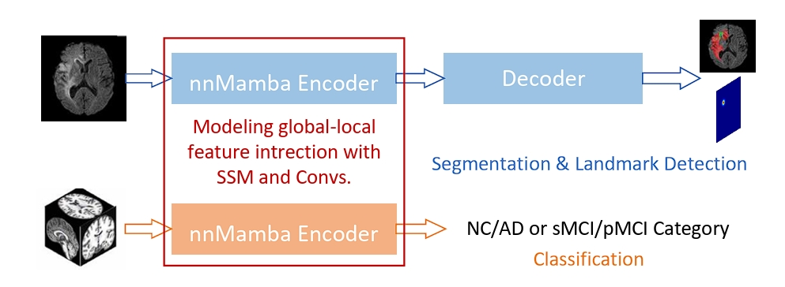

# nnMamba
nnMamba: 3D Biomedical Image Segmentation, Classification and Landmark Detection with State Space Model

In the field of biomedical image analysis, the quest for architectures capable of effectively capturing long-range dependencies is paramount, especially when dealing with 3D image segmentation, classification, and landmark detection. Traditional Convolutional Neural Networks (CNNs) struggle with locality respective field, and Transformers have a heavy computational load when applied to high-dimensional medical images. 
In this paper, we introduce nnMamba, a novel architecture that integrates the strengths of CNNs and the advanced long-range modeling capabilities of State Space Sequence Models (SSMs). Specifically, we propose the Mamba-In-Convolution with Channel-Spatial Siamese learning (MICCSS) block to model the long-range relationship of the voxels. For the dense prediction and classification tasks, we also design the channel-scaling and channel-sequential learning methods. 
Extensive experiments on 6 datasets demonstrate nnMamba's superiority over state-of-the-art methods in a suite of challenging tasks, including 3D image segmentation, classification, and landmark detection. nnMamba emerges as a robust solution, offering both the local representation ability of CNNs and the efficient global context processing of SSMs, setting a new standard for long-range dependency modeling in medical image analysis.



The nnMamba framework is designed for 3D biomedical tasks, focusing on dense prediction and classification. Our approach seeks to tackle the challenge of long-range modeling by leveraging the lightweight and robust long-range modeling capabilities of State Space Models.


Illustrative diagrams of the nnMamba framework architectures. (a) Presents the network structure for segmentation and landmark detection tasks. (b) Depicts the architecture tailored for classification tasks. Detailed structures of the blocks utilized within our networks are shown in (c), (d), and (e).


### If you find this project useful, please consider cite us at
```BibTex
@article{gong2024nnmamba,
  title={nnmamba: 3d biomedical image segmentation, classification and landmark detection with state space model},
  author={Gong, Haifan and Kang, Luoyao and Wang, Yitao and Wan, Xiang and Li, Haofeng},
  journal={arXiv preprint arXiv:2402.03526},
  year={2024}
}
'''
