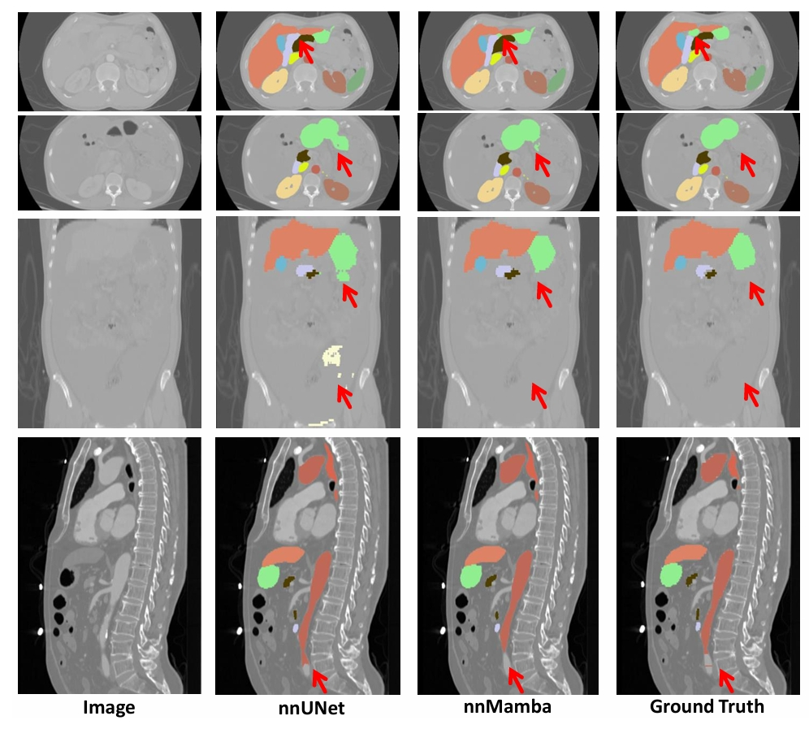

# nnMamba ISBI 2025

nnMamba: 3D Biomedical Image Segmentation, Classification and Landmark Detection with State Space Model

In biomedical image analysis, capturing long-range dependencies is crucial. Traditional Convolutional Neural Networks (CNNs) are limited by their local receptive fields, while Transformers, although proficient at global context integration, are computationally demanding for high-dimensional medical images.

We introduce **nnMamba**, a novel architecture that leverages the strengths of CNNs along with the long-range modeling capabilities of State Space Models (SSMs). Our method features the **Mamba-In-Convolution with Channel-Spatial Siamese Learning (MICCSS)** block that effectively models long-range voxel relationships. Additionally, we employ channel scaling and channel-sequential learning techniques to enhance performance across dense prediction and classification tasks.

Extensive experiments on seven datasets demonstrate that **nnMamba** outperforms current state-of-the-art methods in 3D image segmentation, classification, and landmark detection. By integrating the local representation power of CNNs with the global context processing of SSMs, **nnMamba** sets a new benchmark for modeling long-range dependencies in medical image analysis.


The nnMamba framework is designed for 3D biomedical tasks, focusing on dense prediction and classification. Our approach addresses the challenge of long-range modeling by harnessing the lightweight and robust capabilities of State Space Models.


**Architecture Overview**

- **Dense Prediction (Segmentation and Landmark Detection):** Panels (a) and (b) illustrate the network structure.
- **Classification:** Panel (b) shows the network structure.
- **Detailed Blocks:** Panels (c), (d), and (e) provide specifics of the blocks used within the networks.

**Algorithm: CSS – Channel-Spatial Siamese Learning**

1. **SiamSSM**  
   *SSM with shared parameters.*
2. **x_flat** ← input feature with shape [B, L, C]
3. **x_mamba** ← SiamSSM(x_flat)
4. For each dimension set _d_ in { [1], [2], [1, 2] }:
   - **x_flip** ← flip(x_flat, dims = d)
   - **x_mamba** ← x_mamba + flip(SiamSSM(x_flip), dims = d)
5. **x_mamba** ← (1/4) × x_mamba

Checkpoints are available at:  
<https://drive.google.com/drive/folders/1wYHVSvSU-wGJdU62WZ0B5rfv_bZ68bJl?usp=drive_link>



*Visualization on the AMOS22 CT validation dataset: By modeling long-range dependencies, nnMamba reduces over-segmentation and under-segmentation, especially over long distances.*

## Results

### BraTS 2023 Glioma Segmentation

| Methods                                 | WT    | TC    | ET    | Average | WT   | TC   | ET    | Average |
|-----------------------------------------|-------|-------|-------|---------|------|------|-------|---------|
| **DIT** [Peebles et al., 2023]          | 93.49 | 90.22 | 84.38 | 89.36   | 4.21 | 5.27 | 13.64 | 7.71    |
| **UNETR** [Hatamizadeh et al., 2022]     | 93.33 | 89.89 | 85.19 | 89.47   | 4.76 | 7.27 | 12.78 | 8.27    |
| **nnUNet** [Isensee et al., 2021]        | 93.31 | 90.24 | 85.18 | 89.58   | 4.49 | 4.95 | 11.91 | 7.12    |
| **nnMamba**                             | 93.46 | 90.74 | 85.72 | 89.97   | 4.18 | 5.12 | 10.31 | 6.53    |

*Note: The first four columns correspond to Dice scores, while the last four columns report HD95 values.*

### AMOS2022 Dataset

| Methods                                   | Parameters (M) | FLOPs (G) | CT-Test mDice | CT-Test mNSD | MRI-Test mDice | MRI-Test mNSD |
|-------------------------------------------|----------------|-----------|---------------|--------------|----------------|---------------|
| **nnUNet** [Isensee et al., 2021]         | 31.18          | 680.31    | 89.04         | 78.32        | 67.63          | 59.02         |
| **nnFormer** [Zhou et al., 2023]            | 150.14         | 425.78    | 85.61         | 72.48        | 62.92          | 54.06         |
| **UNETR** [Hatamizadeh et al., 2022]        | 93.02          | 177.51    | 79.43         | 60.84        | 57.91          | 47.25         |
| **SwinUNetr** [Hatamizadeh et al., 2021]    | 62.83          | 668.15    | 86.32         | 73.83        | 57.50          | 47.04         |
| **U-mamba** [Ma et al., 2024]               | 40.00          | 792.87    | 87.53         | 75.83        | 74.21          | 64.79         |
| **nnMamba**                               | 15.55          | 141.14    | 89.63         | 79.73        | 73.98          | 65.13         |

### ADNI Classification

#### NC vs. AD Classification

| Methods                                | ACC              | F1               | AUC              |
|----------------------------------------|------------------|------------------|------------------|
| **ResNet** [He et al., 2016]             | 88.40 ± 3.41     | 88.00 ± 2.81     | 94.93 ± 0.72     |
| **DenseNet** [Huang et al., 2017]          | 87.95 ± 0.70     | 86.93 ± 0.87     | 94.86 ± 0.40     |
| **ViT** [Dosovitskiy et al., 2021]         | 88.85 ± 1.17     | 87.66 ± 1.72     | 94.12 ± 1.29     |
| **CRATE** [Yu et al., 2023]                | 84.69 ± 2.53     | 82.66 ± 3.47     | 91.42 ± 1.43     |
| **nnMamba**                             | 89.53 ± 0.68     | 88.16 ± 1.16     | 95.76 ± 0.18     |

#### sMCI vs. pMCI Classification

| Methods                                | ACC              | F1               | AUC              |
|----------------------------------------|------------------|------------------|------------------|
| **ResNet** [He et al., 2016]             | 67.96 ± 1.50     | 52.14 ± 1.51     | 74.94 ± 2.18     |
| **DenseNet** [Huang et al., 2017]          | 73.12 ± 3.10     | 53.30 ± 2.99     | 76.31 ± 3.09     |
| **ViT** [Dosovitskiy et al., 2021]         | 67.16 ± 3.16     | 51.68 ± 5.72     | 75.08 ± 6.88     |
| **CRATE** [Yu et al., 2023]                | 70.63 ± 2.60     | 53.41 ± 2.53     | 76.06 ± 2.98     |
| **nnMamba**                             | 68.06 ± 4.65     | 53.43 ± 1.64     | 77.55 ± 1.29     |

### Landmark Detection

#### LFC Test Set

| Methods                                 | TCD1         | TCD2         | HDV1         | HDV2         | ADV1         | ADV2         | Average        |
|-----------------------------------------|--------------|--------------|--------------|--------------|--------------|--------------|----------------|
| **ResUNet** [Xu et al., 2019]              | 1.38 ± 0.07  | 1.42 ± 0.10  | 1.46 ± 0.09  | 1.41 ± 0.04  | 1.52 ± 0.00  | 1.18 ± 0.05  | 1.39 ± 0.01    |
| **Hourglass** [Newell et al., 2016]         | 1.40 ± 0.02  | 1.39 ± 0.03  | 1.52 ± 0.03  | 1.45 ± 0.04  | 1.47 ± 0.05  | 1.24 ± 0.02  | 1.41 ± 0.02    |
| **VitPose** [Xu et al., 2022]              | 1.65 ± 0.01  | 1.73 ± 0.05  | 1.69 ± 0.03  | 1.71 ± 0.04  | 1.74 ± 0.04  | 1.38 ± 0.03  | 1.65 ± 0.02    |
| **SwinUnetr** [Hatamizadeh et al., 2021]     | 1.81 ± 0.01  | 1.87 ± 0.03  | 1.82 ± 0.03  | 1.87 ± 0.02  | 1.94 ± 0.02  | 1.42 ± 0.03  | 1.79 ± 0.02    |
| **nnMamba**                             | 1.27 ± 0.01  | 1.40 ± 0.02  | 1.48 ± 0.00  | 1.35 ± 0.02  | 1.43 ± 0.01  | 1.14 ± 0.04  | 1.34 ± 0.01    |

#### FeTA Test Set

| Methods                                 | TCD1         | TCD2         | HDV1         | HDV2         | ADV1         | ADV2         | Average        |
|-----------------------------------------|--------------|--------------|--------------|--------------|--------------|--------------|----------------|
| **ResUNet** [Xu et al., 2019]              | 1.90 ± 0.30  | 1.46 ± 0.23  | 2.19 ± 0.23  | 1.96 ± 0.36  | 2.55 ± 0.48  | 1.73 ± 0.02  | 1.97 ± 0.27    |
| **Hourglass** [Newell et al., 2016]         | 2.43 ± 0.48  | 1.47 ± 0.01  | 2.27 ± 0.04  | 2.10 ± 0.33  | 2.85 ± 0.28  | 1.75 ± 0.05  | 2.15 ± 0.12    |
| **VitPose** [Xu et al., 2022]              | 8.46 ± 3.36  | 9.88 ± 0.97  | 16.47 ± 4.11 | 5.62 ± 0.98  | 14.46 ± 3.86 | 7.07 ± 3.24  | 10.32 ± 1.64   |
| **SwinUnetr** [Hatamizadeh et al., 2021]     | 8.41 ± 0.87  | 6.50 ± 1.29  | 3.83 ± 0.45  | 4.16 ± 0.49  | 4.62 ± 0.39  | 2.44 ± 0.17  | 4.99 ± 0.25    |
| **nnMamba**                             | 1.70 ± 0.10  | 1.41 ± 0.02  | 1.96 ± 0.02  | 1.65 ± 0.03  | 2.20 ± 0.04  | 1.61 ± 0.03  | 1.76 ± 0.01    |

## Citation

If you find this project useful, please consider citing us:
```
@inproceedings{gong2025nnmamba,  
  title={nnmamba: 3D biomedical image segmentation, classification and landmark detection with state space model},  
  author={Gong, Haifan and Kang, Luoyao and Wang, Yitao and Wang, Yihan and Wan, Xiang and Wu, Xusheng and Li, Haofeng},  
  booktitle={ISBI},  
  year={2025}  
}
```
